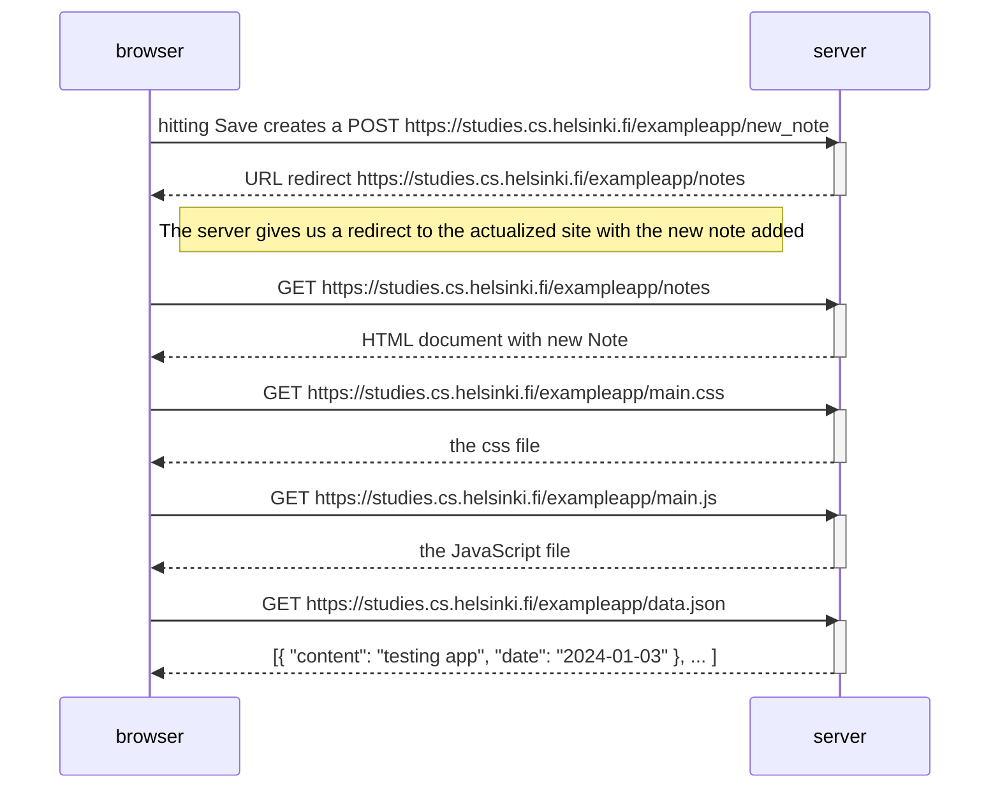

```mermaid
sequenceDiagram
    participant browser
    participant server

    browser->>server: hitting Save creates a POST https://studies.cs.helsinki.fi/exampleapp/new_note
    activate server
    server-->>browser: URL redirect https://studies.cs.helsinki.fi/exampleapp/notes
    deactivate server

    Note right of browser: The server gives us a redirect to the actualized site with the new note added     

    browser->>server: GET https://studies.cs.helsinki.fi/exampleapp/notes
    activate server
    server-->>browser: HTML document with new Note
    deactivate server

    browser->>server: GET https://studies.cs.helsinki.fi/exampleapp/main.css
    activate server
    server-->>browser: the css file
    deactivate server

    browser->>server: GET https://studies.cs.helsinki.fi/exampleapp/main.js
    activate server
    server-->>browser: the JavaScript file
    deactivate server


    browser->>server: GET https://studies.cs.helsinki.fi/exampleapp/data.json
    activate server
    server-->>browser: [{ "content": "testing app", "date": "2024-01-03" }, ... ]
    deactivate server

```
