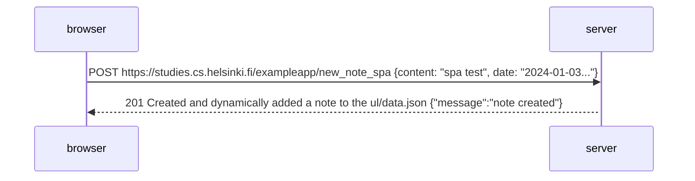

```mermaid
sequenceDiagram
    browser->>server: POST https://studies.cs.helsinki.fi/exampleapp/new_note_spa {content: "spa test", date: "2024-01-03..."}
    activate server
    server-->>browser: 201 Created and dynamically added a note to the ul/data.json {"message":"note created"}
```
    